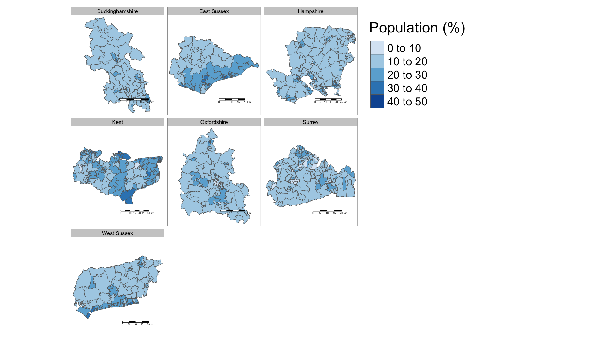

```{r setup, include=FALSE}
knitr::opts_chunk$set(echo = TRUE)
```

# GIS Assignment 1
## Word Count: 600

###Contents:
##### 1. Introduction 
##### 2. Data and Methodology
##### 3. Results
##### 4. Discussion
##### 5. Conclusion
##### References
##### Appendix A
##### Appendix B

### 1. Introduction:
This report serves as a comparison of two major tools for GIS applications: command-line and graphical user interfaces (GUI). By examining, the spatial pattern of people with no qualifications across South East England, this report critically reviews the two tools, their workflow and output.

### 2. Data and Methodology:
Note: In this report, QGIS is used as the representative GUI tool and the combination of RStudio and Python are used for command-line. 
\newline

###### 2.1 Data
Data from the 2011 census detailing: 
1. the number of people with ‘no qualifications’ and 
2. total number of people 
over the age of 16 by middle super output layer (MSOA) was obtained from Office of National Statistics’ NOMIS portal (ONS, 2011). This data was then loaded into both tools and a percentage of persons with no qualification was calculated for each MSOA. 

###### 2.2 Shapefile
Three shapefiles for all the MSOAs, all counties and all regions across the UK were obtained from UK Census 2011 (Census, 2011). The intersection tool within Geoprocessing tools in QGIS was then used to subset the MSOA file to contain only MSOAs within the ‘South East’ region. This was then merged with the data by MSOA code (see 2.1) in QGIS and Python (see Appendix B).  

###### 2.3 Methods
Using each of the tools, 5 groups were classified using a ‘pretty breaks’ classification of values of persons with no qualification (%) by MSOA. In QGIS, three layers, specifically:
1. MSOAs categorised by each 5 groups; 2. UK Counties; 3. UK Regions, were overlaid and their polygon outline widths and transparency were changed. Using the composer manager, a scale bar, legend and north arrow were added to the example GUI map and configured. 

In R, the ‘tmap’ and ‘leaflet’ libraries were used to create an interactive facet plot of the 5 groups organised by each UK county. This interactive map object was then mapped against ESRI’s WorldTopoMap basemap and a legend was added. 

### 3. Results:
Figure 1 (below) shows the map produced by a GUI GIS tool. 

**Figure 1** GUI example map produced in QGIS. Map is given in British National Grid Projection and uses data from ONS (2011).

Figure 2 (below) shows the map produced by a command-line GIS tool. As shown, each region within the facet-plot is scalable and selecting any of MSOA polygon item reveals greater information about it. Note that: Information within each polygon is incorrect, owing to an indexing area within the code (see Appendix A).

```{r, warning=FALSE, message=FALSE, echo=FALSE}
library(tidyverse)
library(maptools)
library(RColorBrewer)
library(classInt)
library(tmap)
library(rgdal)
library(rgeos)
library(sp)
library(sf)
library(raster)
library(tmaptools)
library(methods)
library(rprojroot)
library(magrittr)
library(leaflet)
library(classInt)
library(modEvA) 
library(shinyjs)

# Data Preparation:
# data downloaded at:  http://www.nomisweb.co.uk/census/2011/dc5102ew [accessed 6th Novemeber 2018]
df <- read_csv("data/no_qual_over16.csv")

#read shape for south East containing only msoa within counties 
SEshp <- read_shape("shapes/SouthEast.shp", as.sf = TRUE)
# change projection to WGS84 so that tmap "view" mode works
SEshp <- set_projection(SEshp, projection = 4326)

# make new column of percentage of total
df$perc_no_qual <- (df$no_qual / df$total)*100

# merge
SEmap <- merge(SEshp, df, by.x='msoa11cd', by.y='code')

# remove counties which cross over into the 
toremove <- c("Dorset", "Hertfordshire",
              "Northamptonshire", "Gloucestershire",
              "Outer London", "Warwickshire")

# removes values which are not (!) in toremove list
SEmap <- SEmap[!(SEmap$CTY17NM %in% toremove),]

## Mapping
# Map prerequisits
tmap_mode("view")
tmap_options(limits = c(facets.view = 13))

# Map output
map <- tm_shape(SEmap) +
  tm_polygons("perc_no_qual",
              style="pretty",
              n=5,
              palette="Blues",
              midpoint=NA,
              title="Population (%)",
              legend.is.portrait = TRUE,
              popup.vars=c("msoa11nm","perc_no_qual")) +
  tm_scale_bar() + 
  tm_facets(by = "CTY17NM", nrow = 3, scale.factor=1) +
  tm_view(set.view = 7, basemaps =  c("Esri.WorldTopoMap", "Esri.WorldGrayCanvas"))
map
# save_tmap(map, "commandline_map.png", width=1920, height=1080, asp=0)
```

**Figure 2** Command line example map produced in R. Maps are given in World Geodetic System 1984 and use data from ONS (2011).

### 4. Discussion:
The main contrast between the two tools used for this methodology was that the command -line tool (R) required a greater amount of time to ‘set-up’ before the analyses were run, compared with the GUI tool. However, the GUI took more time to run and the software more frequently crashed. 

Documentation for R is more extensive than for QGIS, which allows you to borrow and adapt code/methods of GIS unlike in QGIS, where methods are static between software updates (Harris, 2017). Notably, for this report, the facet grid of interactive maps produced in R (Figure 2) were adapted from a few chunks of code found online, something which QGIS cannot so easily do.

Singleton & Arribas-Bel (2017) argue that command-line tools offer greater connection between the creation of new GIS methods in academia and their practical use. Although a down side of this is that these methods are often less tried and tested (Gahegan, 2017).

Finally, the reproducibility of both tools varies. In R, the same workflow can easily be used by someone else to get identical results, something which is harder to do with GUI tools (Brunsdon, 2015; 2017).

### 5. Conclusion:
Undoubtedly, the two tools of GIS application can be used in combination with one another to achieve what is required from GIS tools.


### References:
Brunsdon, C. (2015) Quantitative methods I: Reproducible research and quantitative geography, Progress in Human Geography, 1-10.

Brunsdon, C. (2017) Reproducible research, quantitative geography and geocomputation. [Peer commentary on “More bark than bytes? Reflections on 21+ years of geocomputation”, by R. Harris, D. O’Sullivan, M. Gahegan, M. Charlton, L. Comber, P. Longley, C. Brundson, N. Malleson, A. Heppenstall, A. Singleton, D. Arribas-Bel & A. Evans]. Environment and Planning B: Urban Analytics and City Science, 44(4), 607–608. 

Census (UK Data Service) (2018) English Middle Layer Super Output Areas, 2011.[Data]. Available at: https://borders.ukdataservice.ac.uk//easy_download_data.html?data=England_msoa_2011 [Accessed 5th November 2018].

Gahegan, M. (2017) Geocomputation’s 21 year report card: B-, some good progress, but could try harder. [Peer commentary on “More bark than bytes? Reflections on 21+ years of geocomputation”, by R. Harris, D. O’Sullivan, M. Gahegan, M. Charlton, L. Comber, P. Longley, C. Brundson, N. Malleson, A. Heppenstall, A. Singleton, D. Arribas-Bel & A. Evans]. Environment and Planning B: Urban Analytics and City Science, 44(4), 601–604. 

Harris, R. (2016) Quantitative Geography: The Basics. 1st Ed. London: SAGE

ONS (Office of National Statistics) (2018) Highest level of qualification by sex by age. [Data]. Available at: http://www.nomisweb.co.uk/census/2011/dc5102ew [Accessed 5th November 2018].

Singleton, A. & Arribas-Bel, D. (2017) Breaking-out of the ivory tower [Peer commentary on “More bark than bytes? Reflections on 21+ years of geocomputation”, by R. Harris, D. O’Sullivan, M. Gahegan, M. Charlton, L. Comber, P. Longley, C. Brundson, N. Malleson, A. Heppenstall, A. Singleton, D. Arribas-Bel & A. Evans]. Environment and Planning B: Urban Analytics and City Science, 44(4), 598–617.


### Appendix A: Code for Figure 2
```{r, warning=FALSE, message=FALSE}
library(tidyverse)
library(maptools)
library(RColorBrewer)
library(classInt)
library(tmap)
library(rgdal)
library(rgeos)
library(sp)
library(sf)
library(raster)
library(tmaptools)
library(methods)
library(rprojroot)
library(magrittr)
library(leaflet)
library(classInt)
library(modEvA) 
library(shinyjs)

# Data Preparation:
# data downloaded at:  http://www.nomisweb.co.uk/census/2011/dc5102ew [accessed 6th Novemeber 2018]
df <- read_csv("data/no_qual_over16.csv")

#read shape for south East containing only msoa within counties 
SEshp <- read_shape("shapes/SouthEast.shp", as.sf = TRUE)
# change projection to WGS84 so that tmap "view" mode works
SEshp <- set_projection(SEshp, projection = 4326)

# make new column of percentage of total
df$perc_no_qual <- (df$no_qual / df$total)*100

# merge
SEmap <- merge(SEshp, df, by.x='msoa11cd', by.y='code')

# remove counties which cross over into the 
toremove <- c("Dorset", "Hertfordshire",
              "Northamptonshire", "Gloucestershire",
              "Outer London", "Warwickshire")

# removes values which are not (!) in toremove list
SEmap <- SEmap[!(SEmap$CTY17NM %in% toremove),]

## Mapping
# Map prerequisits
tmap_mode("view")
tmap_options(limits = c(facets.view = 13))

# Map output
map <- tm_shape(SEmap) +
  tm_polygons("perc_no_qual",
              style="pretty",
              n=5,
              palette="Blues",
              midpoint=NA,
              title="Population (%)",
              legend.is.portrait = TRUE,
              popup.vars=c("msoa11nm","perc_no_qual")) +
  tm_scale_bar() + 
  tm_facets(by = "CTY17NM", nrow = 3, scale.factor=1) +
  tm_view(set.view = 7, basemaps =  c("Esri.WorldTopoMap"))

```

### Appendix B: Code used to merge shapefile together based on Middle Super Output Areas (MSOAs)
```{Python}
import geopandas as gpd
import pandas as pd
import numpy as np

gdf = gpd.read_file('southeastmsoa.shp')

# read in data (from https://borders.ukdataservice.ac.uk//easy_download_data.html?data=England_msoa_2011 and http://geoportal.statistics.gov.uk/datasets/8d3a9e6e7bd445e2bdcc26cdf007eac7_4?geometry=-44.385%2C49.997%2C39.243%2C58.896)
dfcty = pd.read_csv("ladtocounty.csv")
dflad = pd.read_csv("ladtomsoa.csv")

dfboth = dflad.merge(dfcty, left_on='LAD16CD', right_on='LAD17CD')
dfboth.rename(columns={'MSOA11CD': 'msoa11cd'}, inplace=True)
dfboth.to_csv('msoatocounty.csv', index=False)

dfboth = pd.read_csv('msoatocounty.csv')

# merge shapefile and 
gdf = gdf.merge(new)
gdf.to_file('shapes/SouthEast.shp')
```

