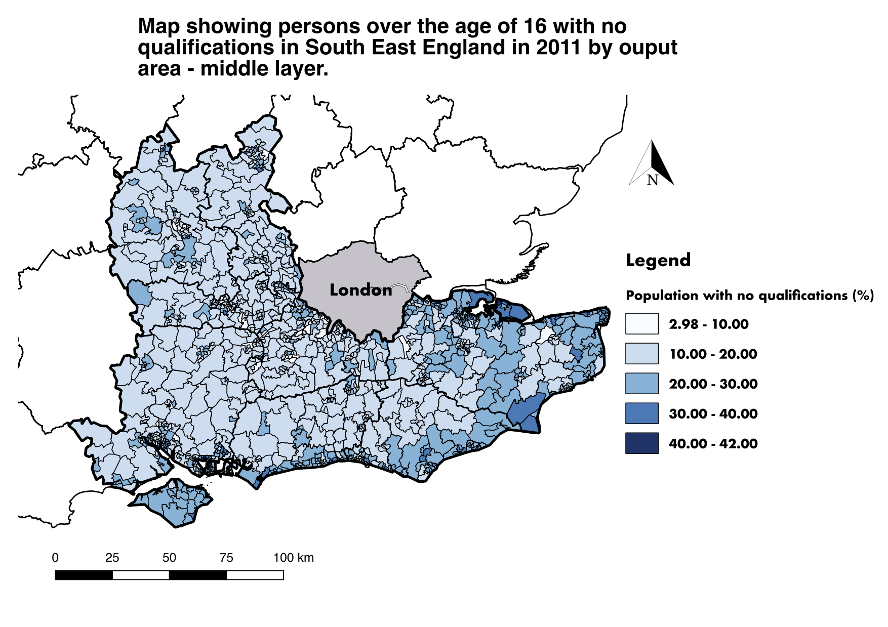

```{r setup, include=FALSE}
knitr::opts_chunk$set(echo = TRUE)
```

# GIS Assignment 1

###Contents:
##### 1. Introduction 
##### 2. Data and Methodology
##### 3. Results
##### 4. Discussion
##### 5. Conclusion
##### References
##### Appendix A
##### Appendix B

## 1. Introduction:
As shown in Figure 1 below, 

**Figure 1** GUI example map produced in QGIS. Map is given in British National Grid Projection and uses data from ONS (2018).


## 2. Data and Methodology:

## 3. Results:
```{r, warning=FALSE, message=FALSE, echo=FALSE}
library(tidyverse)
library(maptools)
library(RColorBrewer)
library(classInt)
library(tmap)
library(rgdal)
library(rgeos)
library(sp)
library(sf)
library(raster)
library(tmaptools)
library(methods)
library(rprojroot)
library(magrittr)
library(leaflet)
library(classInt)
library(modEvA) 
library(shinyjs)

# Data Preparation:
# data downloaded at:  http://www.nomisweb.co.uk/census/2011/dc5102ew [accessed 6th Novemeber 2018]
df <- read_csv("data/no_qual_over16.csv")

#read shape for south East containing only msoa within counties 
SEshp <- read_shape("shapes/SouthEast.shp", as.sf = TRUE)
# change projection to WGS84 so that tmap "view" mode works
SEshp <- set_projection(SEshp, projection = 4326)

# make new column of percentage of total
df$perc_no_qual <- (df$no_qual / df$total)*100

# merge
SEmap <- merge(SEshp, df, by.x='msoa11cd', by.y='code')

# remove counties which cross over into the 
toremove <- c("Dorset", "Hertfordshire",
              "Northamptonshire", "Gloucestershire",
              "Outer London", "Warwickshire")

# removes values which are not (!) in toremove list
SEmap <- SEmap[!(SEmap$CTY17NM %in% toremove),]

## Mapping
# Map prerequisits
tmap_mode("view")
tmap_options(limits = c(facets.view = 13))

# Map output
map <- tm_shape(SEmap) +
  tm_polygons("perc_no_qual",
              style="pretty",
              n=5,
              palette="Blues",
              midpoint=NA,
              title="Population (%)",
              legend.is.portrait = TRUE,
              popup.vars=c("msoa11nm","perc_no_qual")) +
  tm_scale_bar() + 
  tm_facets(by = "CTY17NM", nrow = 3, scale.factor=1) +
  tm_view(set.view = 7, basemaps =  c("Esri.WorldTopoMap", "Esri.WorldGrayCanvas"))
map
```
**Figure 2** Command line example map produced in R. Maps are given in World Geodetic System 1984 and use data from ONS (2018).

## 4. Discussion:
## 5. Conclusion:

## References:
Census (UK Data Service) (2018) English Middle Layer Super Output Areas, 2011.[Data]. Available at: https://borders.ukdataservice.ac.uk//easy_download_data.html?data=England_msoa_2011 [Accessed 5th November 2018].

ONS (Office of National Statistics) (2018) Highest level of qualification by sex by age. [Data]. Available at: http://www.nomisweb.co.uk/census/2011/dc5102ew [Accessed 5th November 2018].


## Appendix A: Code for Figure 2
```{r, warning=FALSE, message=FALSE}
library(tidyverse)
library(maptools)
library(RColorBrewer)
library(classInt)
library(tmap)
library(rgdal)
library(rgeos)
library(sp)
library(sf)
library(raster)
library(tmaptools)
library(methods)
library(rprojroot)
library(magrittr)
library(leaflet)
library(classInt)
library(modEvA) 
library(shinyjs)

# Data Preparation:
# data downloaded at:  http://www.nomisweb.co.uk/census/2011/dc5102ew [accessed 6th Novemeber 2018]
df <- read_csv("data/no_qual_over16.csv")

#read shape for south East containing only msoa within counties 
SEshp <- read_shape("shapes/SouthEast.shp", as.sf = TRUE)
# change projection to WGS84 so that tmap "view" mode works
SEshp <- set_projection(SEshp, projection = 4326)

# make new column of percentage of total
df$perc_no_qual <- (df$no_qual / df$total)*100

# merge
SEmap <- merge(SEshp, df, by.x='msoa11cd', by.y='code')

# remove counties which cross over into the 
toremove <- c("Dorset", "Hertfordshire",
              "Northamptonshire", "Gloucestershire",
              "Outer London", "Warwickshire")

# removes values which are not (!) in toremove list
SEmap <- SEmap[!(SEmap$CTY17NM %in% toremove),]

## Mapping
# Map prerequisits
tmap_mode("view")
tmap_options(limits = c(facets.view = 13))

# Map output
map <- tm_shape(SEmap) +
  tm_polygons("perc_no_qual",
              style="pretty",
              n=5,
              palette="Blues",
              midpoint=NA,
              title="Population (%)",
              legend.is.portrait = TRUE,
              popup.vars=c("msoa11nm","perc_no_qual")) +
  tm_scale_bar() + 
  tm_facets(by = "CTY17NM", nrow = 3, scale.factor=1) +
  tm_view(set.view = 7, basemaps =  c("Esri.WorldTopoMap"))

```

## Appendix B: Code used to merge shapefile together based on Middle Super Output Areas (MSOA)
```{Python}
import geopandas as gpd
import pandas as pd
import numpy as np

gdf = gpd.read_file('southeastmsoa.shp')

# read in data (from https://borders.ukdataservice.ac.uk//easy_download_data.html?data=England_msoa_2011 and http://geoportal.statistics.gov.uk/datasets/8d3a9e6e7bd445e2bdcc26cdf007eac7_4?geometry=-44.385%2C49.997%2C39.243%2C58.896)
dfcty = pd.read_csv("ladtocounty.csv")
dflad = pd.read_csv("ladtomsoa.csv")

dfboth = dflad.merge(dfcty, left_on='LAD16CD', right_on='LAD17CD')
dfboth.rename(columns={'MSOA11CD': 'msoa11cd'}, inplace=True)
dfboth.to_csv('msoatocounty.csv', index=False)

dfboth = pd.read_csv('msoatocounty.csv')

# merge shapefile and 
gdf = gdf.merge(new)
gdf.to_file('shapes/SouthEast.shp')
```

